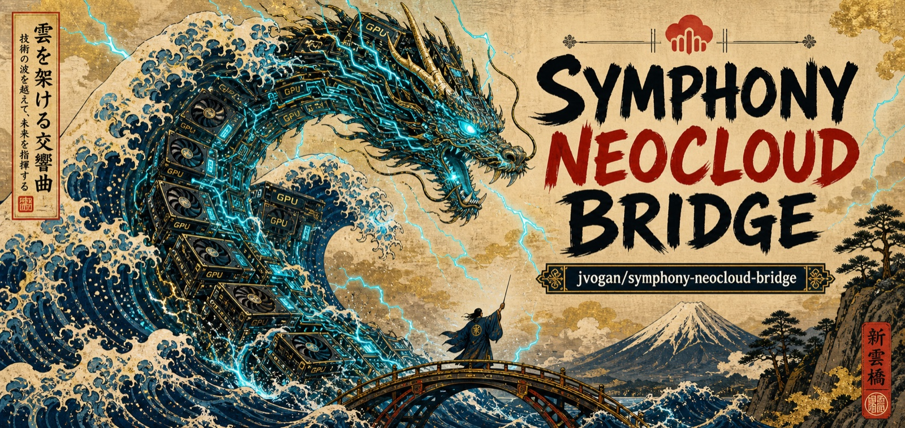

<p align="center">
  
</p>

# Symphony Neocloud Bridge

Make cloud compute usable by AI agents.

AI agents can write the workload, but cloud providers still expect an operator. Symphony Neocloud Bridge gives agents that operator layer: choose the right compute, check that launch is allowed, prepare source safely, run the provider workflow, bring artifacts back, record cost, and prove cleanup.

It is not a cloud provider. It is the bridge between an agent's task and cloud resources such as RunPod, Hugging Face Jobs, AWS, Modal, Lambda, Beam, and similar providers.

Inside are launch manifests, provider setup notes, local preflight checks, startup templates, handoff packets, artifact checks, cost limits, cleanup rules, and learning notes. The bridge also marks which provider paths have automated launch support so agents do not attempt paid actions where the repo only contains guidance. Run `cloud-bridge providers` to see the current coverage.

## How it works

Symphony, an agent orchestrator, assigns a task from your Linear issue tracker to an agent. The agent uses this bridge to start the job on a provider, follow it while it runs, bring back the results, and shut the machine down when it is done.

```text
Linear issue
  -> Symphony Codex worker
  -> local preflight
  -> provider workflow
  -> startup workload
  -> logs/artifacts/hashes
  -> cleanup
  -> Linear symphony-outcome
```

## Cloud Setups

The repo is organized around cloud surfaces an agent may need to use. Each provider area captures setup guidance, launch constraints, monitoring expectations, artifact movement, cost boundaries, and cleanup proof. See [docs/providers/](docs/providers/) and [docs/provider-adapter-contract.md](docs/provider-adapter-contract.md) for details.

| Provider area | Cloud surfaces |
|---|---|
| Pod and VM rental | RunPod · Lambda Cloud · AWS · Beam |
| Function and batch compute | Hugging Face Jobs · Modal · Kaggle · GCP/Vertex |
| Managed inference APIs | Boltz · ESM · NVIDIA NIM · Replicate · fal · Together |
| Cloud glue | S3/object-store egress · secret references · launch locks · cleanup backstops |

Each setup is shaped around the same questions: what can the agent launch, what must be proven before spend, how progress is observed, where artifacts land, how hashes are recorded, and what cleanup proof closes the loop.

Agents can record problems they hit with a provider and search those notes later, so the same issue is not solved twice (`cloud-bridge learnings`). See [skills/cloud-symphony/references/self-learning.md](skills/cloud-symphony/references/self-learning.md).

## What Agents Get

- A way to turn a Linear issue and repo-defined workload into a checked launch packet.
- Dry-run commands that catch missing auth, mutable source, missing artifacts, unsafe egress, and cleanup gaps before paid resources are touched.
- Provider-specific notes for source ingress, registry auth, startup commands, progress checks, artifact pullback, billing, and teardown.
- A consistent closeout shape: status, artifacts, hashes, cost notes, cleanup state, and `symphony-outcome`.
- A learning loop for agents to record cloud-specific gotchas without hardcoding them into domain repos.

## Scope

This bridge is domain-agnostic. It should work for:

- scientific and engineering batch jobs
- model evaluation or adapter jobs
- dataset preprocessing lanes
- figure, report, and artifact-generation lanes
- any Symphony + Linear workflow that can declare commands, validation checks, and artifacts

Domain repos define workload commands and success artifacts. This bridge validates and executes the remote compute contract.

## Non-Negotiables

- No false success: remote run success requires declared artifacts and checks, not just pod lifecycle events.
- Remote launch is opt-in and must be explicitly authorized.
- Secrets stay in secure stores or runtime injection, never templates or repo files.
- Cleanup status is part of the outcome.
- Local dry-run must be possible without any cloud provider.

## Starting Artifacts

- [skills/cloud-symphony/SKILL.md](skills/cloud-symphony/SKILL.md)
- [docs/product-brief.md](docs/product-brief.md)
- [docs/architecture.md](docs/architecture.md)
- [docs/runpod-worker-readiness.md](docs/runpod-worker-readiness.md)
- [docs/runpod-observability-ladder.md](docs/runpod-observability-ladder.md)
- [docs/provider-adapter-contract.md](docs/provider-adapter-contract.md)
- [docs/private-source-storage-runbook.md](docs/private-source-storage-runbook.md)
- [docs/runpod-official-surfaces.md](docs/runpod-official-surfaces.md)
- [docs/runpod-superpowers-2026-05.md](docs/runpod-superpowers-2026-05.md)
- [docs/aws-runpod-superpowers.md](docs/aws-runpod-superpowers.md)
- [docs/discovery.md](docs/discovery.md)
- [templates/runpod-launch-manifest.template.json](templates/runpod-launch-manifest.template.json)
- [templates/linear-runpod-issue.md](templates/linear-runpod-issue.md)
- [templates/symphony-outcome.md](templates/symphony-outcome.md)
- [docs/public-release-checklist.md](docs/public-release-checklist.md)
- [docs/remote-smoke-runbook.md](docs/remote-smoke-runbook.md)

## Local CLI

The bridge has a local-first stdlib Python CLI. Run it from the repo with:

```bash
bin/cloud-bridge validate-manifest templates/runpod-launch-manifest.template.json
bin/cloud-bridge audit-manifests .
bin/cloud-bridge contract-self-check examples/huge-sharded/launch_manifest.json
bin/cloud-bridge doctor
bin/cloud-bridge public-audit
bin/cloud-bridge provider-capabilities runpod
bin/cloud-bridge gpu-catalog --gpu-type-id "NVIDIA A100-SXM4-80GB" --data-center-id US-KS-2 --cloud-type SECURE --json
bin/cloud-bridge aws-orchestrator-plan examples/huge-sharded/launch_manifest.json
bin/cloud-bridge aws-orchestrator-plan examples/aws-orchestrated/launch_manifest.json
bin/cloud-bridge productivity-plan examples/proxy-matrix/launch_manifest.json
bin/cloud-bridge source-check examples/cheap-pod/launch_manifest.json
bin/cloud-bridge egress-plan examples/runpod-network-volume-s3/launch_manifest.json
bin/cloud-bridge profiles
bin/cloud-bridge validate-linear-issue examples/proxy-matrix/linear_issue.md
bin/cloud-bridge linear-issue TEAM-123 --out .runtime/TEAM-123.md
bin/cloud-bridge issue-intake examples/proxy-matrix/linear_issue.md --manifest examples/proxy-matrix/launch_manifest.json --out-dir .runtime/proxy-matrix-intake
bin/cloud-bridge preflight examples/huge-sharded/launch_manifest.json
bin/cloud-bridge egress-plan examples/huge-sharded/launch_manifest.json
bin/cloud-bridge plan examples/public-smoke/launch_manifest.json
bin/cloud-bridge plan examples/cheap-pod/launch_manifest.json
bin/cloud-bridge plan examples/proxy-matrix/launch_manifest.json
bin/cloud-bridge prepare examples/cheap-pod/launch_manifest.json --out-dir .runtime/cheap-pod-packet
bin/cloud-bridge render-runpodctl-create examples/cheap-pod/launch_manifest.json
bin/cloud-bridge prepare examples/proxy-matrix/launch_manifest.json --out-dir .runtime/proxy-matrix-packet
bin/cloud-bridge validate-handoff .runtime/proxy-matrix-packet/provider_handoff.json || test $? -eq 1
bin/cloud-bridge plan examples/small-cpu/launch_manifest.json
bin/cloud-bridge render-startup examples/small-cpu/launch_manifest.json --out .runtime/startup.sh
bin/cloud-bridge run-local examples/cheap-pod/launch_manifest.json --repo-dir .runtime/cheap-pod-repo --runtime-dir .runtime/cheap-pod-run
bin/cloud-bridge run-local examples/proxy-matrix/launch_manifest.json --repo-dir .runtime/proxy-matrix-repo --runtime-dir .runtime/proxy-matrix-run
bin/cloud-bridge create-pod examples/cheap-pod/launch_manifest.json --out-dir .runtime/cheap-pod-remote || test $? -eq 2
```

After a run has produced `runpod-execution/status.json` and heartbeats, inspect it with:

```bash
bin/cloud-bridge monitor examples/small-cpu/launch_manifest.json --base-dir .
bin/cloud-bridge supervise examples/small-cpu/launch_manifest.json --base-dir .
```

For remote monitor updates, run repeated `bin/cloud-bridge progress-report ... --previous ...` samples and report `classification.state` verbatim with the classification booleans; do not summarize monitor liveness as workload progress.

Remote creation is guarded. `create-pod` writes an audited request/resource record without touching RunPod by default, and actual creation requires `remote_launch_allowed: true`, explicit `launch_authorization`, an immutable repo reference, a passing `contract-self-check` with route proof, `RUNPOD_API_KEY`, no active duplicate pod prefix, `--execute`, and `--yes-create-paid-runpod`. The mutating `run-remote` and `run-handoff` flows also take an atomic local launch lock before pod creation; set `RUNPOD_BRIDGE_LOCK_DIR` or `--lock-dir` if several orchestrators should share one lock directory.

For cost attribution, fill `billing.cost_center`, `billing.project_code`, and `billing.resource_owner` in the manifest before launch. These fields are local closeout metadata; provider-side RunPod cost-center assignment should still be verified through the supported operator surface. If `runpod.interruptible` is true, the bridge requires checkpoint/resume policy and durable artifact egress before paid launch.

For Symphony/Codex workers, first prove the worker shell can reach RunPod REST. Some sandboxed worker runtimes have no outbound DNS/TCP even when `RUNPOD_API_KEY` is injected. In that mode, use the worker for `validate-manifest`, `prepare`, and `run-local`. The prepared packet includes `provider_handoff.json`; run that from an unsandboxed orchestrator or trusted `after_run` hook with `run-handoff`.

For a capped smoke, prefer the single-command remote runner. It creates the pod, verifies declared artifacts, and always attempts cleanup when a pod was created:

```bash
bin/cloud-bridge run-remote path/to/launch_manifest.json \
  --out-dir .runtime/remote-smoke \
  --max-spend-usd 5 \
  --verification-mode auto \
  --execute \
  --yes-create-paid-runpod \
  --yes-cleanup-runpod
```

The runner writes one top-level `.runtime/remote-smoke/remote_run_record.json` plus nested create, packet, and cleanup records. `--verification-mode auto` tries direct TCP artifact verification first, then the RunPod HTTP proxy fallback.

For worker-to-orchestrator handoff, use the provider handoff instead of retyping the manifest path:

```bash
bin/cloud-bridge validate-handoff runpod-execution/provider_handoff.json
bin/cloud-bridge run-handoff runpod-execution/provider_handoff.json \
  --out-dir .runtime/handoff-run \
  --max-spend-usd 5 \
  --execute \
  --yes-create-paid-runpod \
  --yes-cleanup-runpod
```

Remote inspection and cleanup commands are also available:

```bash
bin/cloud-bridge list-pods --name-prefix symphony-
bin/cloud-bridge get-pod POD_ID
bin/cloud-bridge gpu-catalog --manifest path/to/launch_manifest.json --json
bin/cloud-bridge runtime-metrics POD_ID --expected-elapsed-minutes 5 --json
bin/cloud-bridge progress-report path/to/launch_manifest.json POD_ID --previous .runtime/POD_ID-progress-1.json --out .runtime/POD_ID-progress-2.json
bin/cloud-bridge pod-ssh-info POD_ID
bin/cloud-bridge verify-proxy-packet examples/proxy-matrix/launch_manifest.json POD_ID --port 8000 --out-dir .runtime/proxy-matrix-proxy
bin/cloud-bridge verify-tcp-packet examples/proxy-matrix/launch_manifest.json POD_ID --port 8000 --out-dir .runtime/proxy-matrix-tcp
bin/cloud-bridge verify-network-volume-s3 examples/runpod-network-volume-s3/launch_manifest.json --out-dir .runtime/network-volume-s3-verify
bin/cloud-bridge registry-auth-plan path/to/launch_manifest.json
bin/cloud-bridge cleanup-pod POD_ID --action delete
bin/cloud-bridge cost-report .runtime/remote-smoke/remote_run_record.json --fetch-billing
bin/cloud-bridge remote-outcome .runtime/remote-smoke/remote_run_record.json --out runpod-execution/symphony_outcome.md
bin/cloud-bridge billing-endpoints --start-time 2026-05-01T00:00:00Z --bucket-size day
bin/cloud-bridge billing-network-volumes --start-time 2026-05-01T00:00:00Z --bucket-size day
bin/cloud-bridge billing-pods --backend runpodctl --start-time 2026-05-01T00:00:00Z --bucket-size day
bin/cloud-bridge dashboard --scan-dir .runtime --out .runtime/runpod-dashboard.html
```

`preflight` reports rendered RunPod POST body size. Keep inline startup payloads below the bridge hard limit; large embedded scripts/data should be compressed or moved to a repo, packet, network volume, or object store before remote launch.

HTTP proxy and direct TCP packet verification are inspection aids for sanitized, short-lived smoke artifacts. Production or private workloads should use workspace archives plus SCP, network volume, presigned S3 upload, or object-store egress for durable artifact proof. `startup.progress.http_status_server_port` can expose a live `/healthz` progress endpoint during the workload; `startup.inspection.http_artifact_server_port` is a completion-only artifact server that starts after the workload reaches `inspection_hold`. `aws_s3_presigned_upload` can upload the archive with a runtime-injected S3 PUT URL and no AWS credentials in the pod. `object_store_upload` startup support can upload the archive and hash file with the AWS CLI when `RUNPOD_OBJECT_STORE_URI` and runtime credentials are injected. For required object-store modes, pod-side `uploaded` evidence is not final success; closeout requires orchestrator-side object/hash verification recorded as `egress_status: verified`.

Public GitHub repos, public GHCR/Docker Hub images, and public HTTP artifact endpoints are for sanitized smokes only. For private work, use [docs/private-source-storage-runbook.md](docs/private-source-storage-runbook.md): private registry auth through `runpod.containerRegistryAuthId`, prepared snapshots with `archive_url_ref`, or a RunPod network-volume snapshot staged through the S3-compatible API. `source-ingress-plan` renders the exact upload/proof commands for that mounted snapshot path.

Use RunPod Secure Cloud for paid bridge runs by default. Community Cloud is treated as lower-trust shared/peer-hosted compute and is allowed only for explicit public/synthetic sanitized smokes with `safety.community_cloud_allowed: true`.

For an orchestrator-side queue, scan or run prepared handoffs:

```bash
bin/cloud-bridge orchestrator-scan .runtime
bin/cloud-bridge orchestrator-once .runtime \
  --out-root .runtime/orchestrator \
  --max-spend-usd 5
```

Use `--execute --yes-create-paid-runpod --yes-cleanup-runpod` only after the handoff is validated and paid launch is authorized.

When a Linear closeout body is ready, post it only with explicit mutation confirmation:

```bash
bin/cloud-bridge linear-comment TEAM-123 --body-file runpod-execution/symphony_outcome.md --execute --yes-comment-linear
```

## Public Release

Run `bin/cloud-bridge public-audit` before publishing. It checks required release files, JSON validity, manifest validity, contract self-checks, and release-readiness text policy. Run `bin/cloud-bridge audit-manifests <domain-repo> --migration-hints --summary-only` in downstream workload repos to catch stale copied launch bundles before a worker tries to launch them, and drop `--summary-only` when you need per-file details. Run `bin/cloud-bridge audit-runpod-ops <domain-repo> --summary-only` to catch old operational recipes such as direct RunPod REST mutation, local app config key scraping, or split create/cleanup flows. See [docs/manifest-migration-guide.md](docs/manifest-migration-guide.md) and [docs/runpod-status-taxonomy.md](docs/runpod-status-taxonomy.md) when porting older workload bundles.

## License

MIT — see [LICENSE](LICENSE).
