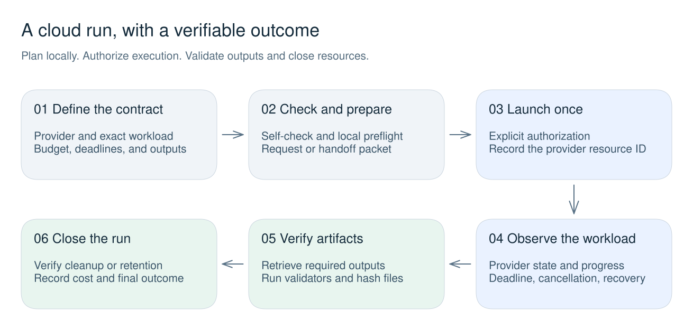

<p align="center">
  
</p>

# Neocloud Bridge

Neocloud Bridge helps AI agents use cloud compute for demanding research and engineering tasks. It combines provider guides, workload manifests, launch tools, and result checks so agents can run work on cloud CPUs and GPUs and bring usable artifacts back.

Use it for biological data analysis, model evaluation, simulations, and multi-stage tool chains. Your agent chooses the tools and sequences the work; the bridge handles each supported cloud run, including spending limits, output retrieval, and cleanup.

## What agents can do

| Capability | What you get |
| --- | --- |
| Find suitable compute | Provider comparisons and searchable catalogs, with memory, runtime, storage, and lifecycle considerations |
| Move demanding work off the laptop | Automated RunPod Pod and Hugging Face Job execution; setup guides for additional clouds and inference APIs |
| Chain tools through files | Ordered workload commands, declared output files, validation commands, and hashes for downstream inputs |
| Run larger experiments | Shard and checkpoint contracts, monitoring, and recovery records for workflows defined by your project |
| Make results reproducible | Exact commands, source references, logs, validated artifacts, and cost and cleanup records |



## Biological research and tool chaining

A research workflow often needs several kinds of compute. An agent can prepare data on a CPU, run a model on a GPU, and summarize the outputs locally. Each stage names the files it consumes and produces, so the next tool can check its inputs before running.

| Research task | Example tool chain | Useful outputs |
| --- | --- | --- |
| Expression-table quality checks | Parse a count matrix → check structure and counts → summarize samples → render a report | Input hash, sample totals, and a quality-check report |
| Microscopy analysis | Prepare image batches → run project-selected image analysis → aggregate measurements | Measurement tables, masks, and review images |
| Protein structure analysis | Prepare existing structures → run project-selected analysis tools → compare outputs | Per-structure measurements, figures, and provenance |
| Model evaluation | Partition a dataset → run evaluations → validate results → assemble a comparison | Per-run metrics, logs, and a comparison table |

The [expression-table example](examples/research-table-qc/) runs locally with synthetic data. The other rows illustrate workflows you can supply from your own project. The [agent workflow guide](docs/agent-workflows.md) explains how to connect stages and reuse their artifacts.

## Run a working example

From this repository, Python 3.10 or newer is enough:

```bash
bin/cloud-bridge providers
bin/cloud-bridge validate-manifest examples/research-table-qc/launch_manifest.json
bin/cloud-bridge contract-self-check examples/research-table-qc/launch_manifest.json
python3 examples/research-table-qc/run_example.py
```

The example creates a fresh workspace under `.runtime/`, checks a synthetic count table, and prints the report path. Each run preserves `qc.json`, `report.md`, and artifact hashes. It uses local Python and requires no cloud account. See the [example guide](examples/research-table-qc/) for expected values and output paths.

For an installed CLI, run `python -m pip install -e .`.

## Choose a provider

| Provider surface | Bridge support |
| --- | --- |
| RunPod Pods; Hugging Face one-shot Jobs | Automated launch, observation, artifact retrieval, and closeout |
| AWS | Setup guidance and rendered storage, registry, queue, lock, and cleanup plans |
| Modal, Lambda Cloud, Beam | Setup guidance for function, batch, and VM compute |
| fal, Replicate, Together | Setup guidance for managed inference |
| Boltz, ESM, NVIDIA NIM | Setup guidance for biological inference |
| Kaggle, Google Cloud | Setup guidance for notebook and batch compute |

`cloud-bridge providers` reports executable support. For other providers, use the documented setup or a project-owned execution path with its own run contract.

| Decision | Reference |
| --- | --- |
| Which provider fits the workload? | [Compute landscape](docs/providers/compute-landscape.md) |
| Where can I compare offers and benchmarks? | [Compute directories](docs/providers/compute-directories.md) |
| How do I budget retries, storage, and idle time? | [Selection and operating guide](docs/providers/selection-guide.md) |
| What does each adapter implement? | [Provider support matrix](docs/providers/README.md) |

## Run on cloud compute

Declare the provider, source, commands, outputs, budget, runtime, and cleanup policy in a manifest. Validate the contract and run preflight before executing. The [RunPod reference](docs/providers/runpod.md) and [Hugging Face Jobs reference](docs/providers/huggingface.md) describe their respective launch commands.

An authorized run produces retrieved artifacts, validation results, hashes, cost records, and a verified cleanup or retention state. Secret values come from runtime injection; manifests contain references.

The RunPod runner uses REST API v1, which retires on **November 15, 2026**. See the [migration reference](docs/providers/runpod.md) for the remaining v2 work.

## Use with your agent

Agents can invoke `cloud-bridge` through a shell or use the bundled [Neocloud Bridge skill](skills/cloud-symphony/SKILL.md), invoked as `$cloud-symphony`. Your agent or workflow engine owns cross-stage dependencies and scheduling. Symphony and Linear are optional integrations for dispatch and issue tracking.

## Documentation

- [Agent workflows](docs/agent-workflows.md)
- [Architecture](docs/architecture.md) and [product brief](docs/product-brief.md)
- [CLI reference](skills/cloud-symphony/references/cli-reference.md)
- [Provider adapter contract](docs/provider-adapter-contract.md)
- [Private source and storage](docs/private-source-storage-runbook.md)
- [Monitoring](docs/runpod-observability-ladder.md) and [worker readiness](docs/runpod-worker-readiness.md)
- [Contributing](CONTRIBUTING.md)

## License

MIT. See [LICENSE](LICENSE).
