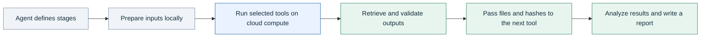

# Connect tools and compute with an AI agent

Give each stage an input contract, an execution command, and output checks. Your agent can then pass validated files between local tools, cloud jobs, and inference services.

## Start with a working chain

The [expression-table example](../examples/research-table-qc/) uses two ordered commands. The first checks a synthetic count matrix and writes a JSON summary. The second reads that summary and produces a Markdown report. The bridge runs validation and records hashes for both artifacts.

| Stage | Input | Output | Check before the next stage |
| --- | --- | --- | --- |
| Summarize | Count-table CSV | `qc.json` | Unique identifiers, rectangular rows, nonnegative integer counts, and input SHA-256 |
| Report | `qc.json` | `report.md` | Summary schema and sample totals |
| Verify | Original CSV and both outputs | Validation result and artifact hashes | Recomputed summary and report match the recorded files |

Run the example with the commands in its README. Replace the synthetic input and analysis code in your own project when you need a different scientific workflow.

## Extend a chain across providers

Use one manifest per provider run. Keep short preparation and reporting steps local when they do not need remote hardware. Place expensive tools on compute that fits their memory, runtime, and data-location requirements.

| Handoff field | Purpose |
| --- | --- |
| Input artifact URI or relative path | Identifies the file the next tool consumes |
| SHA-256 and producing run ID | Binds the input to a specific upstream result |
| Tool version and exact command | Defines how the stage runs |
| Expected outputs and validation commands | Defines when the stage has usable results |
| Checkpoint and resume policy | Specifies which completed work can be reused |
| Runtime, retry, and cost limits | Bounds repeated execution |

Your agent waits for upstream validation before submitting dependent work. If a stage fails, inspect its logs and partial outputs, then resume or rerun according to its contract. Reuse an artifact only when its input and tool-version requirements still match.

The bridge executes ordered commands within a run. Your agent or workflow engine schedules dependencies between runs, including transitions between providers.

## Biological research patterns

For expression data, retain feature and sample identifiers throughout the chain. Record the input hash with every derived table so later plots and comparisons refer to the same dataset.

For microscopy, define a stable image inventory before partitioning work. Keep per-image measurements linked to their source images, and validate the expected image count before aggregation.

For analysis of existing protein structures, retain structure identifiers, model versions, analysis parameters, and per-structure results. Let the scientific workflow define the validation appropriate to those results.

These are stage-design patterns. Your project supplies the analysis tools, parameters, and scientific interpretation. The [biological provider reference](providers/bio-inference.md) describes the registered inference services and their bridge support.

## Select the execution path

Use `run-local` to exercise commands and artifact checks on your machine. Use `run-remote` for a completed RunPod contract or `run-job` for Hugging Face Jobs. For another provider, inspect its [reference](providers/README.md) and use a validated project-owned path or implement an adapter.

Use the [compute landscape](providers/compute-landscape.md) to compare execution models and the [selection guide](providers/selection-guide.md) to account for storage, retries, and resource lifetime.
