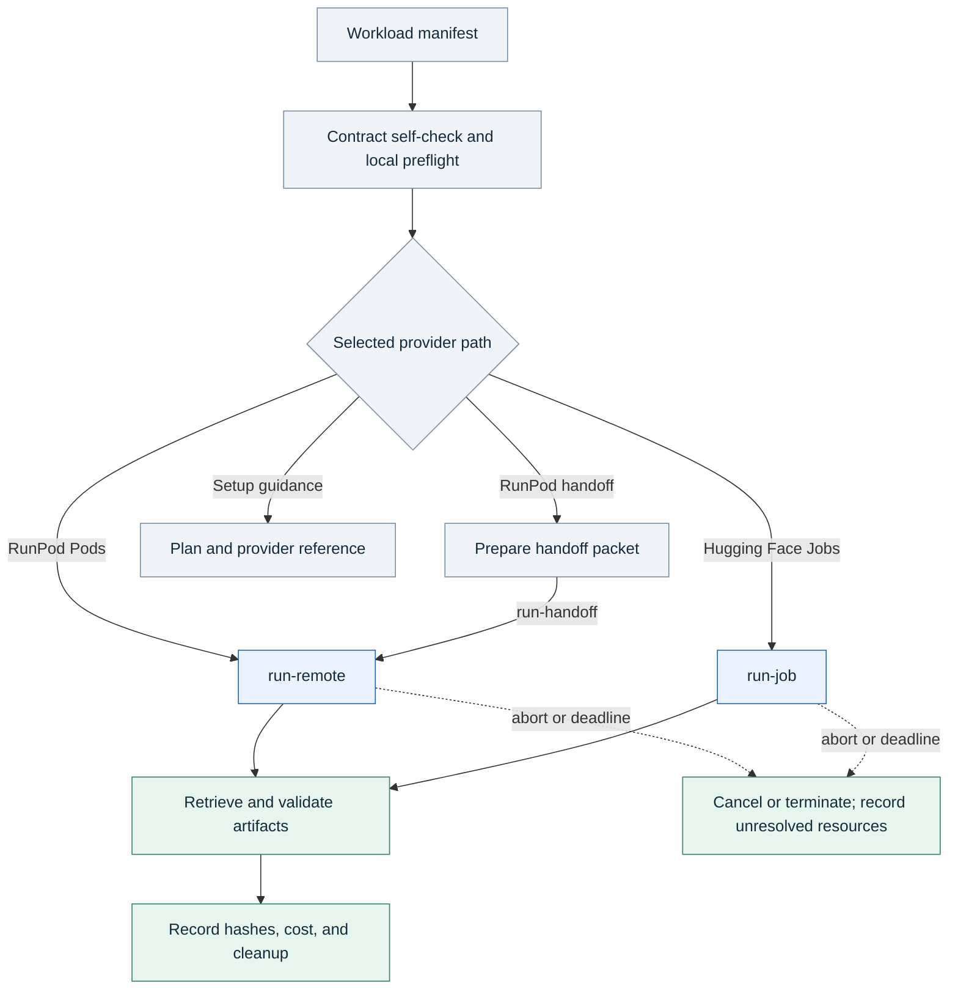

# Architecture

The bridge separates workload requirements from provider execution. Domain repositories define success; provider adapters manage resource creation, observation, output retrieval, and cleanup.

## Responsibilities

| Component | Owns |
| --- | --- |
| Domain repository | Commands, input policy, expected artifacts, and domain validation |
| Neocloud Bridge | Contract checks, provider lifecycle, artifact transfer, costs, and cleanup verification |
| AI agent or workflow engine | Tool selection, stage dependencies, work dispatch, and interpretation of results |
| Cloud provider | Compute, storage, networking, telemetry, and billing records |

The common contract stays provider-neutral. Provider-specific resource fields live under named blocks such as `runpod` or `huggingface`, and each provider adapter states which lifecycle stages it implements.

## Execution flow

1. Read the workload manifest supplied by an agent, operator, or workflow engine.
2. Validate authorization, immutable source, budget, runtime, cleanup, monitoring, validation commands, and expected artifacts.
3. Run the contract self-check and local preflight.
4. For RunPod, prepare a launch packet and optional orchestrator handoff. For Hugging Face Jobs, render the request with `run-job`.
5. For RunPod handoff, assign a trusted orchestrator when the worker cannot reach the provider or does not own mutation.
6. Use the provider-specific guarded runner only when the registry marks that path as automated.
7. Track provider state separately from workload progress.
8. Retrieve and validate declared artifacts, then write SHA-256 hashes.
9. Reconcile cost and verify deletion, termination, or approved retention.
10. Write structured closeout records for the agent and any connected tracker.

Setup guidance describes provider capabilities without exposing a bridge launch command. A project-owned execution path has its own authorization, spending, retry, artifact, and cleanup contract.

## Tool chaining and integrations

An agent can execute several tools in one run or connect separate runs through validated files. The bridge checks each run; the agent or workflow engine schedules cross-run dependencies. See [agent workflows](agent-workflows.md) for the handoff fields and a working example.

Symphony and Linear are optional dispatch and tracking integrations. The CLI retains the `symphony-outcome` format for existing consumers. Local execution and direct provider commands work without a Linear account.

## Adapter boundary

The provider registry determines bridge launch support. It exposes guarded runners for RunPod Pods and Hugging Face Jobs. Other entries provide setup knowledge and reject paid launch through the bridge.

Provider categories define closeout behavior:

- `compute_rental`: a machine, pod, function deployment, or endpoint may keep billing until it is removed.
- `managed_inference`: individual calls are metered; persistent endpoint variants still require teardown.
- `notebook_job`: a submitted job should terminate, but scheduled jobs, runtimes, or attached storage may persist.

See [provider-adapter-contract.md](provider-adapter-contract.md) for the complete portable contract.

## RunPod control planes

The RunPod runner uses REST API v1 for Pod lifecycle and billing, plus GraphQL for GPU catalog and runtime samples. API v2 adds log streams, catalog endpoints, billing surfaces, and revised resource schemas. RunPod documents v1 retirement on November 15, 2026. See the [API v2 overview](https://docs.runpod.io/api-reference-v2/overview) and [v1 migration guide](https://docs.runpod.io/api-reference-v2/migrate-from-v1).

Until the runner migrates, v2 is a documented compatibility priority rather than an implemented bridge path. The bridge must not imply that v2 log streaming or cluster control is already wired into its CLI.

`runpodctl` remains an optional operator tool for SSH details, billing, and command review. Version 2.10.0 added Pod and Serverless log streaming. Version 2.12.0 removed `--stop-after` and `--terminate-after`, so bridge cleanup and an independent orchestrator backstop remain necessary. See the [official releases](https://github.com/runpod/runpodctl/releases).

The official RunPod agent plugin and MCP server can provide provider-native tools. They do not replace the bridge's authorization, evidence, and cleanup gates.

## Success gate

Do not report success from resource creation, provider readiness, command submission, exit status, or log presence alone.

Success requires all of the following:

- required artifacts were retrieved;
- artifact validation passed;
- required hashes were recorded;
- cost was recorded or clearly marked as an estimate;
- cleanup or approved retention was verified.
