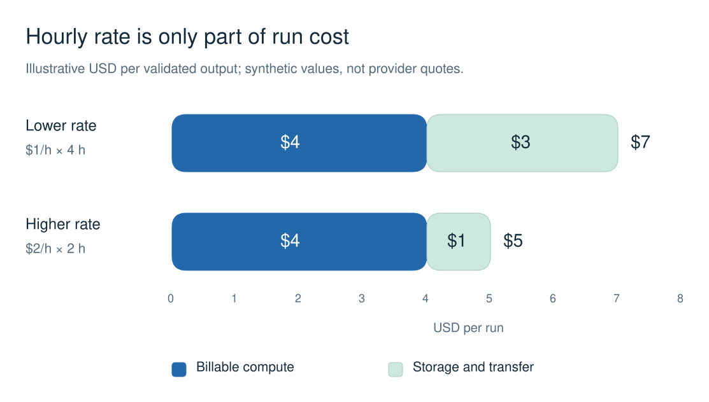

# Choose and operate cloud compute

Choose an execution model first, then compare providers that meet your memory, data-location, runtime, and recovery requirements. The [compute landscape](compute-landscape.md) describes provider options; the [support matrix](README.md) identifies executable bridge paths.

Sources reviewed: 2026-09-22. These are selection and adapter-design requirements. Individual adapters implement only the features documented in their provider references.

## Match the workload

| Workload | Execution model | Check before choosing |
| --- | --- | --- |
| One container with a finite output | Batch job | Maximum duration, cancellation, durable output upload, and queue delay |
| Custom drivers, interactive debugging, or a long process | GPU VM or Pod | Image compatibility, SSH readiness, disk lifecycle, and termination controls |
| Independent bursts of custom code | Serverless function or queue worker | Cold start, concurrency, retry behavior, execution limit, and warm capacity |
| Requests to an existing model | Managed inference API | Model version, input limits, result retention, request metering, and data policy |
| Sustained model serving | Dedicated endpoint | Minimum replicas, scale-down behavior, deployment deletion, and storage |
| Synchronized multi-node training | GPU cluster | Interconnect topology, placement, checkpoint bandwidth, and capacity commitment |

Record GPU memory per device, device count, CPU/RAM, local scratch space, architecture, and driver requirements separately. Total advertised GPU memory does not establish whether one model fits on one device.

## Compare complete cost

Compare cost per validated output at the required latency. Include all billable phases and resources:

```text
run cost = compute during startup, execution, retries, and idle time
         + persistent storage and snapshots
         + data transfer and request charges
         + applicable reservation or minimum-use charges
```

The chart illustrates why rate alone can reverse a choice. Both runs produce the same validated output. Values are synthetic, use USD, and exclude taxes.



| Illustrative run | Compute | Storage and transfer | Total |
| --- | --- | --- | --- |
| Lower hourly rate | $1/hour × 4 billable hours = $4 | $3 | $7 |
| Higher hourly rate | $2/hour × 2 billable hours = $4 | $1 | $5 |

Billable hours include startup and repeated attempts in this example. Measure your workload before treating a faster device as better value. Catalog rates, account quotes, and observed invoices answer different questions; record which one supports the estimate.

## Bound the lifecycle

| Control | Record in the execution contract | Failure to prevent |
| --- | --- | --- |
| Resource creation | Run ID, one mutation owner, provider ID, and reconciliation after an ambiguous response | A timed-out create request followed by a duplicate paid resource |
| Deadlines | Queue wait, startup, execution, total supervision, and cleanup deadlines | A queue or boot phase consuming the entire runtime allowance |
| Retries | Maximum attempts, retryable failures, idempotent output writes, and remaining budget | Repeated work and duplicate side effects |
| Concurrency | Maximum workers, devices per worker, and minimum warm workers | Autoscaling beyond the spending estimate |
| Recovery | Checkpoint location, commit marker, resume command, and maximum lost work | A restart that repeats the full workload |
| Outputs | Run-specific location, required files, validators, size limits, and hashes | Expired results or artifacts from a different run |
| Cleanup | Resources to remove, approved retention, owner, and independent deadline enforcement | A failed supervisor leaving compute or storage billable |

Provider semantics differ. RunPod Serverless separates job TTL from execution timeout and bills active workers while idle. A worker limit bounds concurrency, so pair it with a finite deadline and a cost estimate. [RunPod endpoint settings](https://docs.runpod.io/serverless/endpoints/endpoint-configurations)

Modal documents retries and container failure recovery. Design output writes so a repeated attempt can detect completed work before creating side effects. [Modal failures and retries](https://modal.com/docs/guide/retries)

Hugging Face Jobs expose configurable timeouts and external storage options. Persist artifacts before the job ends, and keep scheduled-job cleanup separate from one-shot cancellation. [Jobs configuration](https://huggingface.co/docs/hub/jobs-configuration), [scheduled Jobs](https://huggingface.co/docs/hub/jobs-schedule)

## Close compute and storage separately

| Resource | Completion evidence | Closeout action |
| --- | --- | --- |
| VM or Pod | Terminal workload result and validated outputs | Terminate or record explicitly approved retention |
| Batch job | Terminal job status and retrieved artifacts | Confirm termination; cancel unfinished work |
| Inference request | Complete response or retrieved asynchronous result | Record request status, usage, and output hashes |
| Endpoint | Desired deployment state and final request results | Disable or delete serving capacity; verify minimum replicas |
| Volume, snapshot, or bucket | Durable artifact receipt and retention decision | Delete unneeded storage or record its continuing cost |
| Schedule or webhook | No further launches required | Remove the trigger separately from the last job |

RunPod network volumes survive Pod termination. A stopped Pod's volume disk can also remain billable. Treat artifact retrieval, compute termination, and storage retention as distinct closeout checks. [RunPod storage options](https://docs.runpod.io/pods/storage/types)

## Keep runs portable

Pin source revisions and container digests. Pass secrets through provider-supported injection, restrict network access to the workload's needs, and record the approved data region. Keep provider credentials out of startup logs and output artifacts.

For interruptible capacity, write checkpoints to storage that survives the instance and test resume behavior with a bounded local fixture. Compare the expected savings with restart work and transfer time.

Before execution, validate the exact request, expected outputs, budget, retry policy, and cleanup owner. Use the [adapter contract](../provider-adapter-contract.md) when implementing a provider path. A catalog entry alone does not establish launch support.
